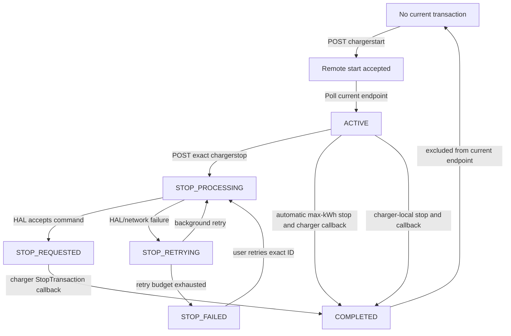

# Frontend charging-session API contract

## Purpose and scope

This document is the frontend integration contract for the passenger charging
flow exposed by the CMS backend:

- request a charger start;
- discover and restore the user's current OCPP transaction;
- display the lifecycle of one or more current transactions;
- request a stop for one exact OCPP transaction;
- wait for charger-originated completion;
- refresh charging history and billing after completion.

The central rule is:

> An OCPP transaction is identified by `transactionid`. Never infer it from the
> newest database row, charger ID, connector ID, user ID, array position, or
> start time.

The CMS route prefix is `/users`. The three frontend routes covered here are:

| Operation | Method | Path |
| --- | --- | --- |
| Request start | `POST` | `/users/chargerstart` |
| Get current transaction(s) | `POST` | `/users/getongoingtransaction` |
| Request exact stop | `POST` | `/users/chargerstop` |

The OCPP HAL callback routes `/users/checkstartresponse` and
`/users/deductcalculate` are server-to-server routes. They must never be called
by the frontend.

## Identity and authentication

### Passenger identity

The normal passenger/mobile-app account is stored in the CMS `User` model. Staff
and administrative accounts are stored in `UserProfile`. Frontend code must not
infer authorization or transaction ownership from these table names.

Use the authenticated JWT claim:

```json
{
  "userid": "the-canonical-user-id"
}
```

The same canonical value must be sent as `userid` in the request body.

### Required headers

```http
Content-Type: application/json
Authorization: Bearer <CMS JWT>
```

The bearer token is validated whenever it is present:

- valid token and matching body `userid`: request continues;
- valid token but different body `userid`: `403`;
- invalid or expired token: `401`;
- an invalid bearer token never falls back to legacy body authentication.

During the compatibility window, a request without a bearer token is accepted
when:

```env
ALLOW_LEGACY_TRANSACTION_IDENTITY=true
```

This compatibility behavior is temporary. After all frontend clients send the
JWT, production should use:

```env
ALLOW_LEGACY_TRANSACTION_IDENTITY=false
```

Do not put `OCPP_API_KEY` or the HAL `x-api-key` in frontend code. Those are
server-to-server secrets.

## Identifier rules

### `transactionid`

The frontend contract represents `transactionid` as a string:

```ts
type OcppTransactionId = string;
```

Valid values are positive base-10 integers from `1` through `2147483647`.

Examples:

```text
"1"
"9451203"
"2147483647"

-"0"
-"-10"
-"10.5"
-"1e5"
-"some-session-name"
```

The API can accept a safe JSON number for compatibility, but the frontend should
store and transmit a string. Do not call `parseInt`, apply arithmetic, generate
an ID locally, or replace the ID with a database `uid`.

### `connectorid`

`connectorid` is also best represented as a string. It must be a positive
integer. The backend canonicalizes it before sending it to the OCPP HAL.

### `uid`

`transaction.uid` is the CMS row UUID. It is not the OCPP transaction ID and
must not be sent as `transactionid`.

## Lifecycle semantics

Only charger-originated OCPP messages establish start and completion truth:

1. The frontend asks the CMS to start.
2. CMS asks the HAL to send `RemoteStartTransaction`.
3. A successful `/chargerstart` response means the remote command was accepted.
4. The charger later sends OCPP `StartTransaction`.
5. HAL sends `/users/checkstartresponse` to CMS.
6. CMS creates the exact `ChargerTransaction` with status `ACTIVE`.
7. The frontend discovers it through `/getongoingtransaction`.
8. Frontend, automatic max-kWh control, or the charger may initiate stopping.
9. A remote-stop acknowledgement does not mean charging is finalized.
10. The charger sends OCPP `StopTransaction`.
11. HAL sends `/users/deductcalculate` to CMS.
12. CMS atomically records the session, deducts the wallet, records history,
    marks the transaction `COMPLETED`, and queues billing.



### Status definitions

| Status | Meaning | Recommended UI |
| --- | --- | --- |
| `ACTIVE` | CMS has the charger-originated start and no completion. | Show charging; enable exact stop. |
| `STOP_PROCESSING` | One stop call is currently contacting the HAL. | Disable duplicate action; show “Requesting stop…”. |
| `STOP_REQUESTED` | HAL accepted remote stop; completion has not arrived. | Show “Stopping…” and poll. |
| `STOP_RETRYING` | HAL rejected, timed out, or was unreachable; CMS scheduled another attempt. | Show “Stop pending—retrying”; continue polling. |
| `STOP_FAILED` | Automatic stop retry budget was exhausted. | Show failure and an explicit “Retry stop” action using the same ID. |
| `RECONCILE_REQUIRED` | CMS cannot safely assert the live state. | Disable normal stop; show support/reconciliation state. |
| `COMPLETED` | Charger completion was committed. | Not returned by the current endpoint; refresh sessions and bills. |
| `UNKNOWN` | Historical row whose live state was not safely inferable during migration. | Not returned by the current endpoint. |

`stale: true` is not a lifecycle status and does not prove completion. It means
the current row is older than the requested warning threshold.

## API 1: Request charging start

### Request

```http
POST /users/chargerstart
Content-Type: application/json
Authorization: Bearer <JWT>
```

```json
{
  "chargerid": "CP-001",
  "userid": "passenger-user-id",
  "useraccept": true,
  "connectorid": "1"
}
```

### Request fields

| Field | Type | Required | Rules |
| --- | --- | --- | --- |
| `chargerid` | string | yes | Canonical CMS/HAL charger ID. |
| `userid` | string | yes | Must equal JWT `userid`. |
| `useraccept` | boolean or legacy string | yes | Send boolean `true`. String `"true"` is compatibility-only. |
| `connectorid` | string or integer | yes | Positive integer; prefer string. |

### Successful response

```http
200 OK
```

```json
{
  "message": "Charging started",
  "identity_source": "bearer"
}
```

Important: this response means the HAL accepted the remote-start command. It
does not contain `transactionid`, because the charger has not necessarily sent
OCPP `StartTransaction` yet.

After this response, enter an `AWAITING_TRANSACTION` frontend state and poll
`/users/getongoingtransaction`.

### Start error responses

#### Missing request data

```http
400 Bad Request
```

```json
{
  "message": "Missing chargerid, userid, or connectorid"
}
```

#### User did not accept

```http
400 Bad Request
```

```json
{
  "message": "User acceptance is required to start charging"
}
```

#### Invalid connector

```http
400 Bad Request
```

```json
{
  "status": "Error",
  "message": "connectorid must be a positive integer"
}
```

#### Insufficient usable wallet balance

```http
400 Bad Request
```

```json
{
  "message": "Wallet balance is not sufficient to start charging. Please recharge"
}
```

Usable balance is the wallet balance above the configured hard limit. The
backend, not the frontend, calculates whether enough balance exists.

#### Existing current transaction

```http
409 Conflict
```

```json
{
  "message": "User already has an ongoing charging transaction",
  "transactionid": "9451203",
  "chargerid": "CP-001"
}
```

Do not retry start. Switch to the current-session screen and load
`/getongoingtransaction`.

#### Start already in progress

```http
409 Conflict
```

```json
{
  "message": "A charging start request is already in progress",
  "chargerid": "CP-001",
  "connectorid": "1"
}
```

This protects against double taps, multiple browser tabs, multiple app
instances, and two users racing for the same charger connector. Continue polling
for the current transaction rather than issuing another start.

The start-intent lock expires after the backend-configured TTL, currently ten
minutes by default.

#### HAL rejected the remote start

```http
400 Bad Request
```

```json
{
  "message": "Charging could not be started.",
  "status": "Rejected",
  "detail": "optional HAL detail"
}
```

Do not enter the active-session state. The start intent is released, so a later
explicit retry is possible.

#### Identity errors

```http
401 Unauthorized
```

```json
{
  "message": "Invalid or expired bearer token"
}
```

or:

```http
403 Forbidden
```

```json
{
  "message": "Transaction does not belong to the authenticated user"
}
```

#### CMS, database, or HAL connectivity error

```http
500 Internal Server Error
```

```json
{
  "status": "Error",
  "message": "error detail"
}
```

Treat this as an unknown start outcome. Before enabling another start, call the
current-session endpoint. This prevents a timeout response from causing a second
session when the first command actually reached the charger.

## API 2: Get current transaction(s)

Call this endpoint:

- when the app starts;
- when the user signs in;
- when the charging screen mounts;
- when the app returns to the foreground;
- after network reconnection;
- immediately before requesting another start;
- after `/chargerstart` returns `200` or `409`;
- repeatedly while charging or stopping.

### Request

```http
POST /users/getongoingtransaction
Content-Type: application/json
Authorization: Bearer <JWT>
```

```json
{
  "userid": "passenger-user-id",
  "chargerid": "CP-001",
  "stale_after_minutes": 720
}
```

### Request fields

| Field | Type | Required | Rules |
| --- | --- | --- | --- |
| `userid` | string | yes | Must equal JWT `userid`. |
| `chargerid` | string | no | When omitted, returns current transactions across chargers. |
| `stale_after_minutes` | integer or numeric string | no | Warning threshold; minimum `1`, default `720`. |

### Current transaction response

```http
200 OK
```

```json
{
  "message": "Ongoing charging transaction found",
  "ongoing": true,
  "can_request_stop": true,
  "stale": false,
  "age_minutes": 4,
  "stale_after_minutes": 720,
  "ambiguous": false,
  "transaction": {
    "uid": "cms-row-uuid",
    "chargerid": "CP-001",
    "userid": "passenger-user-id",
    "transactionid": "9451203",
    "connectorid": "1",
    "max_kwh": "7.50",
    "status": "ACTIVE",
    "stopattempts": 0,
    "stoprequestedat": null,
    "laststoperror": null,
    "createdAt": "2026-07-20T10:00:00.000Z",
    "updatedAt": "2026-07-20T10:00:00.000Z"
  },
  "transaction_count": 1,
  "ongoing_transactions": [
    {
      "uid": "cms-row-uuid",
      "chargerid": "CP-001",
      "userid": "passenger-user-id",
      "transactionid": "9451203",
      "connectorid": "1",
      "max_kwh": "7.50",
      "status": "ACTIVE",
      "stopattempts": 0,
      "stoprequestedat": null,
      "laststoperror": null,
      "createdAt": "2026-07-20T10:00:00.000Z",
      "updatedAt": "2026-07-20T10:00:00.000Z"
    }
  ],
  "manual_stop": {
    "endpoint": "/users/chargerstop",
    "method": "POST",
    "body": {
      "userid": "passenger-user-id",
      "chargerid": "CP-001",
      "transactionid": "9451203"
    }
  },
  "note": "CMS lifecycle state is keyed by the exact OCPP transaction ID; only the completion callback marks it completed.",
  "identity_source": "bearer"
}
```

### Response-field semantics

| Field | Meaning |
| --- | --- |
| `ongoing` | Always `true` in a `200` current response. |
| `transaction` | Newest current transaction, preserved as the primary compatibility field. |
| `ongoing_transactions` | All current rows found for the user/filter, newest first, maximum 50. |
| `transaction_count` | Length of `ongoing_transactions`. |
| `ambiguous` | `true` when more than one current transaction exists. |
| `can_request_stop` | Whether the primary `transaction` can use the normal stop flow. |
| `stale` | Whether the primary transaction exceeds `stale_after_minutes`. |
| `age_minutes` | Age of the primary transaction, rounded down. |
| `manual_stop` | Exact stop contract for the primary transaction. |
| `identity_source` | `bearer` or temporary `legacy_body`. |

### Multiple current transactions

Example:

```json
{
  "message": "Multiple ongoing charging transactions require reconciliation",
  "ongoing": true,
  "ambiguous": true,
  "transaction_count": 2,
  "transaction": {
    "transactionid": "9451204"
  },
  "ongoing_transactions": [
    {
      "transactionid": "9451204",
      "chargerid": "CP-002",
      "connectorid": "1",
      "status": "ACTIVE"
    },
    {
      "transactionid": "9451203",
      "chargerid": "CP-001",
      "connectorid": "1",
      "status": "STOP_REQUESTED"
    }
  ]
}
```

Frontend requirements:

1. Do not silently select the newest row as “the” session.
2. Render every entry in `ongoing_transactions`.
3. Key list items and local state by `transactionid`.
4. When stopping one entry, send that entry's `transactionid`, `chargerid`, and
   `userid`.
5. Do not use `manual_stop.body` to stop a different list entry; that object is
   for the primary transaction only.

### No current transaction

```http
404 Not Found
```

```json
{
  "message": "No ongoing charging transaction found",
  "ongoing": false,
  "checked_recent_transactions": 0
}
```

For this endpoint, `404` is a normal idle state. Do not show a generic
“Something went wrong” notification.

After a stop was pending, this response means no transaction remains in the
current lifecycle set. Refresh charging-session history and billing.

### Current-session errors

| HTTP | Example message | FE action |
| --- | --- | --- |
| `400` | `Missing userid` | Client validation defect; do not retry unchanged. |
| `401` | `Invalid or expired bearer token` | Refresh authentication or sign in. |
| `403` | `Transaction does not belong to the authenticated user` | Clear unsafe local user/session state. |
| `500` | `Failed to fetch ongoing charging transaction` | Keep last known state, show connectivity warning, retry with backoff. |

## API 3: Request an exact stop

### Request

```http
POST /users/chargerstop
Content-Type: application/json
Authorization: Bearer <JWT>
```

```json
{
  "chargerid": "CP-001",
  "userid": "passenger-user-id",
  "transactionid": "9451203"
}
```

### Request fields

| Field | Type | Required | Rules |
| --- | --- | --- | --- |
| `chargerid` | string | yes | Must match the stored transaction. |
| `userid` | string | yes | Must match JWT and stored transaction. |
| `transactionid` | string | required by new FE | Exact ID from the current endpoint. |

The backend looks up `transactionid` uniquely and then verifies both ownership
and charger ID. It does not select the latest row.

### Stop accepted

```http
200 OK
```

```json
{
  "message": "Charger stop requested",
  "status": "Accepted",
  "transactionid": "9451203",
  "identity_source": "bearer"
}
```

The `status` value may also be lowercase `processing` when another stop call is
already in flight.

Do not show “Charging completed” from this response. Enter `STOP_PENDING` and
poll `/getongoingtransaction` until the transaction disappears or its state
requires intervention.

### Already completed

An explicit retry for an ID that completed between lookup and stop processing
can return:

```http
200 OK
```

```json
{
  "message": "Charging transaction is already completed",
  "status": "completed",
  "transactionid": "9451203",
  "already_processed": true,
  "identity_source": "bearer"
}
```

Refresh charging history and billing.

### HAL rejection or network failure with durable retry

```http
400 Bad Request
```

```json
{
  "message": "Charger stop request rejected",
  "status": "Rejected",
  "detail": "optional failure detail",
  "transactionid": "9451203",
  "retry_scheduled": true,
  "identity_source": "bearer"
}
```

This is a special `400`: `retry_scheduled: true` means CMS retained the exact
transaction and will retry in the background. The frontend should:

1. keep the transaction on screen;
2. show “Stop pending—retrying”;
3. continue polling;
4. not issue a new start;
5. optionally provide an explicit retry only after `STOP_FAILED`.

### Stop errors

#### Missing charger or user

```http
400 Bad Request
```

```json
{
  "message": "Missing chargerid or userid"
}
```

#### Invalid transaction ID

```http
400 Bad Request
```

```json
{
  "message": "transactionid must be an unsigned base-10 integer"
}
```

#### Exact transaction not found or tuple mismatch

```http
404 Not Found
```

```json
{
  "message": "Charging transaction not found"
}
```

The same response is used when the ID exists but does not belong to the supplied
user and charger. The frontend must not fall back to a newest-row stop.

#### Legacy request has no transaction ID

During the compatibility window, a request without `transactionid` succeeds only
if exactly one explicit current row matches the user and charger.

Compatibility success adds:

```json
{
  "legacy_transaction_resolution": true
}
```

No matches:

```http
404 Not Found
```

```json
{
  "message": "No ongoing charging transaction found"
}
```

Multiple matches:

```http
409 Conflict
```

```json
{
  "message": "Multiple ongoing transactions found; transactionid is required"
}
```

The new frontend must always send `transactionid`; legacy resolution is not a
supported long-term client strategy.

#### CMS/database failure

```http
500 Internal Server Error
```

```json
{
  "message": "Charger stop request failed",
  "error": "error detail"
}
```

Keep polling current state before deciding whether to expose a retry.

## Recommended frontend state model

Use frontend states that distinguish command acknowledgement from charger truth:

```ts
type ChargingUiPhase =
  | "IDLE"
  | "START_REQUESTING"
  | "AWAITING_TRANSACTION"
  | "ACTIVE"
  | "STOP_REQUESTING"
  | "STOP_PENDING"
  | "STOP_RETRYING"
  | "STOP_FAILED"
  | "RECONCILE_REQUIRED"
  | "COMPLETED"
  | "CONNECTION_ERROR";
```

Suggested mapping:

| Backend result | UI phase |
| --- | --- |
| Current endpoint `404` before start | `IDLE` |
| Start request in flight | `START_REQUESTING` |
| Start `200` or start-in-progress `409` | `AWAITING_TRANSACTION` |
| Current status `ACTIVE` | `ACTIVE` |
| Stop request in flight | `STOP_REQUESTING` |
| `STOP_PROCESSING` or `STOP_REQUESTED` | `STOP_PENDING` |
| `STOP_RETRYING` | `STOP_RETRYING` |
| `STOP_FAILED` | `STOP_FAILED` |
| `RECONCILE_REQUIRED` | `RECONCILE_REQUIRED` |
| Previously known current transaction becomes `404` | `COMPLETED`, then refresh history |

Do not persist `COMPLETED` as charger truth solely because a stop HTTP request
returned `200`.

## TypeScript contracts

```ts
export type OcppTransactionId = string;
export type ConnectorId = string;

export type ChargingTransactionStatus =
  | "ACTIVE"
  | "STOP_PROCESSING"
  | "STOP_REQUESTED"
  | "STOP_RETRYING"
  | "STOP_FAILED"
  | "RECONCILE_REQUIRED";

export interface CurrentChargingTransaction {
  uid: string | null;
  chargerid: string;
  userid: string;
  transactionid: OcppTransactionId;
  connectorid: ConnectorId | null;
  max_kwh: string | null;
  status: ChargingTransactionStatus;
  stopattempts: number;
  stoprequestedat: string | null;
  laststoperror: string | null;
  createdAt: string;
  updatedAt: string;
}

export interface StartChargingRequest {
  chargerid: string;
  userid: string;
  useraccept: true;
  connectorid: ConnectorId;
}

export interface StartChargingAccepted {
  message: "Charging started";
  identity_source: "bearer" | "legacy_body";
}

export interface GetCurrentChargingRequest {
  userid: string;
  chargerid?: string;
  stale_after_minutes?: number;
}

export interface CurrentChargingResponse {
  message: string;
  ongoing: true;
  can_request_stop: boolean;
  stale: boolean;
  age_minutes: number;
  stale_after_minutes: number;
  ambiguous: boolean;
  transaction: CurrentChargingTransaction;
  transaction_count: number;
  ongoing_transactions: CurrentChargingTransaction[];
  manual_stop: {
    endpoint: "/users/chargerstop";
    method: "POST";
    body: StopChargingRequest;
  };
  note: string;
  identity_source: "bearer" | "legacy_body";
}

export interface NoCurrentChargingResponse {
  message: "No ongoing charging transaction found";
  ongoing: false;
  checked_recent_transactions: number;
}

export interface StopChargingRequest {
  chargerid: string;
  userid: string;
  transactionid: OcppTransactionId;
}

export interface StopChargingAccepted {
  message:
    | "Charger stop requested"
    | "Charging transaction is already completed";
  status: string;
  transactionid: OcppTransactionId;
  identity_source: "bearer" | "legacy_body";
  already_processed?: true;
  legacy_transaction_resolution?: true;
}

export interface StopChargingRetryScheduled {
  message: "Charger stop request rejected";
  status?: string;
  detail?: string;
  transactionid: OcppTransactionId;
  retry_scheduled: true;
  identity_source: "bearer" | "legacy_body";
}

export interface CmsApiErrorBody {
  message?: string;
  status?: string;
  detail?: string;
  error?: string;
  transactionid?: OcppTransactionId;
  chargerid?: string;
  connectorid?: string;
  retry_scheduled?: boolean;
}
```

## Reference API client

```ts
export class CmsApiError<T = CmsApiErrorBody> extends Error {
  constructor(
    public readonly statusCode: number,
    public readonly body: T,
  ) {
    super(
      typeof body === "object" && body && "message" in body
        ? String(body.message)
        : `CMS request failed with ${statusCode}`,
    );
  }
}

async function cmsPost<TRequest, TResponse>(
  baseUrl: string,
  path: string,
  token: string,
  body: TRequest,
): Promise<TResponse> {
  const response = await fetch(`${baseUrl}${path}`, {
    method: "POST",
    headers: {
      "Content-Type": "application/json",
      Authorization: `Bearer ${token}`,
    },
    body: JSON.stringify(body),
  });

  const text = await response.text();
  let payload: unknown = {};
  try {
    payload = text ? JSON.parse(text) : {};
  } catch {
    payload = { message: text || `HTTP ${response.status}` };
  }

  if (!response.ok) {
    throw new CmsApiError(response.status, payload as CmsApiErrorBody);
  }
  return payload as TResponse;
}

export function requestChargingStart(
  baseUrl: string,
  token: string,
  request: StartChargingRequest,
) {
  return cmsPost<StartChargingRequest, StartChargingAccepted>(
    baseUrl,
    "/users/chargerstart",
    token,
    request,
  );
}

export async function getCurrentChargingTransactions(
  baseUrl: string,
  token: string,
  request: GetCurrentChargingRequest,
): Promise<CurrentChargingResponse | NoCurrentChargingResponse> {
  try {
    return await cmsPost<
      GetCurrentChargingRequest,
      CurrentChargingResponse
    >(
      baseUrl,
      "/users/getongoingtransaction",
      token,
      request,
    );
  } catch (error) {
    if (error instanceof CmsApiError && error.statusCode === 404) {
      return error.body as NoCurrentChargingResponse;
    }
    throw error;
  }
}

export function requestChargingStop(
  baseUrl: string,
  token: string,
  request: StopChargingRequest,
) {
  return cmsPost<StopChargingRequest, StopChargingAccepted>(
    baseUrl,
    "/users/chargerstop",
    token,
    request,
  );
}
```

For stop requests, catch `CmsApiError` and treat a body with
`retry_scheduled === true` as `STOP_RETRYING`, not as a terminal client error.

## Start orchestration

Reference logic:

```ts
async function startAndResolveTransaction(input: {
  baseUrl: string;
  token: string;
  userid: string;
  chargerid: string;
  connectorid: string;
  signal?: AbortSignal;
}): Promise<CurrentChargingTransaction> {
  const currentBeforeStart = await getCurrentChargingTransactions(
    input.baseUrl,
    input.token,
    {
      userid: input.userid,
    },
  );

  if (currentBeforeStart.ongoing) {
    return currentBeforeStart.transaction;
  }

  try {
    await requestChargingStart(input.baseUrl, input.token, {
      userid: input.userid,
      chargerid: input.chargerid,
      connectorid: input.connectorid,
      useraccept: true,
    });
  } catch (error) {
    if (!(error instanceof CmsApiError) || error.statusCode !== 409) {
      throw error;
    }
    // An existing transaction or start intent means: resolve current state.
  }

  const deadline = Date.now() + 60_000;
  while (Date.now() < deadline) {
    if (input.signal?.aborted) throw input.signal.reason;

    const current = await getCurrentChargingTransactions(
      input.baseUrl,
      input.token,
      {
        userid: input.userid,
      },
    );
    if (current.ongoing) return current.transaction;

    await new Promise((resolve) => setTimeout(resolve, 2_000));
  }

  throw new Error(
    "Remote start was accepted, but the charger has not established a transaction yet",
  );
}
```

The timeout is a UI timeout, not proof that start failed. Keep the app capable of
recovering the transaction through foreground/resume polling.

## Stop orchestration

Reference logic:

```ts
async function stopExactTransaction(input: {
  baseUrl: string;
  token: string;
  transaction: CurrentChargingTransaction;
}): Promise<"STOP_PENDING" | "COMPLETED"> {
  try {
    const result = await requestChargingStop(input.baseUrl, input.token, {
      userid: input.transaction.userid,
      chargerid: input.transaction.chargerid,
      transactionid: input.transaction.transactionid,
    });
    if (result.already_processed || result.status === "completed") {
      return "COMPLETED";
    }
    return "STOP_PENDING";
  } catch (error) {
    if (
      error instanceof CmsApiError &&
      error.statusCode === 400 &&
      error.body.retry_scheduled === true
    ) {
      return "STOP_PENDING";
    }
    throw error;
  }
}
```

After `STOP_PENDING`, poll the current endpoint. A typical interval is two to
five seconds while the charging screen is visible. Use increasing backoff while
the app is in the background.

## Polling and recovery behavior

### Before start

Always query current state first. This prevents:

- double-tap starts;
- a second tab starting another transaction;
- a retry after an HTTP timeout starting a second transaction;
- app reinstall or lost local state hiding a live session.

### After start acceptance

Poll every two seconds for up to a UI-defined foreground timeout. If no
transaction appears:

- show “Waiting for charger…”;
- allow navigation without declaring failure;
- query again when the screen/app resumes;
- do not allow another start until current state has been checked.

### While active

Poll approximately every five seconds while visible. The backend is the source
of lifecycle state; local timers are display helpers only.

### After stop

Poll every two to five seconds. Continue showing the exact transaction while it
is `STOP_PROCESSING`, `STOP_REQUESTED`, or `STOP_RETRYING`.

When the current endpoint returns `404` after a previously observed transaction:

1. remove it from the current-session UI;
2. refresh `/users/chargingsessionbyuserid`;
3. refresh the appropriate billing endpoint;
4. allow a new start only after current state remains empty.

### Offline/network errors

Do not clear a known current transaction because polling failed. Preserve it
locally with a “State unavailable” indicator and retry. Only a successful CMS
response can replace the last known state.

### Multi-tab and multi-device behavior

The database protects start and stop races, but the frontend should still:

- broadcast current-state changes between tabs when possible;
- disable the start button while a start call is in flight;
- disable duplicate stop presses while status is already pending;
- recover state from CMS rather than trusting only local storage.

## Button and screen behavior

### Start button

Disable when:

- start request is in flight;
- phase is `AWAITING_TRANSACTION`;
- any current transaction exists;
- current-state lookup has not completed;
- authentication is unavailable.

### Stop button

| Current status | Default action |
| --- | --- |
| `ACTIVE` | Enabled; send exact ID. |
| `STOP_PROCESSING` | Disabled; show spinner. |
| `STOP_REQUESTED` | Disabled; show pending. |
| `STOP_RETRYING` | Disabled by default; CMS is retrying. |
| `STOP_FAILED` | Enabled as “Retry stop”; send same exact ID. |
| `RECONCILE_REQUIRED` | Disabled; show support action. |

### Stale transaction

When `stale: true`, show a warning such as:

> This charging session has been open longer than expected. Its state is still
> being verified.

Do not label it completed and do not remove it.

## Billing and charging-history consequences

Billing generation is now durable and asynchronous. Wallet deduction, charging
session creation, history creation, and lifecycle completion happen in one
database transaction. PDF generation happens afterward.

Frontend consequences:

- a completed session may appear before its PDF bill appears;
- after completion, refresh session history immediately;
- tolerate temporary absence from bill-list endpoints;
- show “Receipt is being generated” instead of treating a missing immediate PDF
  as charging failure;
- never retry stop merely because a bill is not yet visible.

The existing billing and history routes remain unchanged. No OCPP callback
payload or internal billing job should be exposed to the frontend.

## Error-handling matrix

| Endpoint | HTTP | Condition | Retry policy |
| --- | --- | --- | --- |
| start | `200` | Remote start accepted | Poll current state. |
| start | `400` | Validation, wallet, or HAL rejection | Fix input/show message; no automatic start retry. |
| start | `401` | Invalid/expired JWT | Reauthenticate. |
| start | `403` | JWT/body user mismatch | Clear unsafe local identity state. |
| start | `409` | Current session or start intent exists | Poll current state; do not send another start. |
| start | `500` | Unknown server/HAL outcome | Query current state before any retry. |
| current | `200` | One or more current rows | Render returned state. |
| current | `404` | No current rows | Normal idle/completed transition. |
| current | `401/403` | Authentication/ownership | Reauthenticate or clear unsafe state. |
| current | `500` | State lookup unavailable | Preserve last known state and back off. |
| stop | `200` | Stop accepted, processing, or already completed | Poll unless already completed. |
| stop | `400` + `retry_scheduled` | HAL/network failure retained for retry | Show pending; poll. |
| stop | other `400` | Invalid request/ID | Do not retry unchanged. |
| stop | `404` | Exact ID/user/charger tuple not found | Refresh current state; never choose latest. |
| stop | `409` | Legacy no-ID request is ambiguous | Refresh list and send an exact ID. |
| stop | `500` | Server failure | Preserve state and refresh before retry. |

## Backward compatibility

Compatibility retained:

- route names are unchanged;
- start accepts `useraccept: "true"` as well as boolean `true`;
- stop can temporarily omit `transactionid` when exactly one current row
  matches;
- body-only identity can temporarily work when enabled;
- `transaction` remains the primary current-session field;
- existing history and bill routes are unchanged.

New frontend code must not depend on those compatibility paths. It should:

- send a bearer token;
- send boolean `true`;
- use `ongoing_transactions`;
- store IDs as strings;
- send exact `transactionid` for stop.

## Backend-only behavior relevant to frontend expectations

- Start callbacks are idempotent by exact transaction ID.
- Transaction-ID collisions with a different user/charger/connector are rejected.
- Completion callbacks are idempotent and concurrent duplicates deduct once.
- Wallet recharge and charging deductions serialize on the wallet row.
- The same GST-inclusive tariff semantics calculate both `max_kwh` and final cost.
- Zero-consumption completions are valid.
- Manual and background stop attempts never mark completion by themselves.
- Stop retries use exponential backoff, capped at thirty minutes.
- PDF billing retries independently of the OCPP callback.
- Historical `UNKNOWN` rows are not shown as active.
- `COMPLETED` rows are not returned by the current endpoint.

## Frontend acceptance checklist

### Authentication

- [ ] All three requests send `Authorization: Bearer <JWT>`.
- [ ] Body `userid` is the JWT `userid`.
- [ ] A different user's body ID produces `403`.
- [ ] Expired JWT produces the login/refresh flow.

### Start

- [ ] FE checks current state before start.
- [ ] Double tap sends at most one effective start.
- [ ] Start `200` shows “Waiting for charger”, not “Session completed”.
- [ ] Start `409` switches to current-state polling.
- [ ] Insufficient balance shows recharge UI.
- [ ] Start `500` triggers current-state recovery before retry.

### Current session

- [ ] `404` is rendered as normal idle.
- [ ] `transactionid` is stored as a string.
- [ ] List keys use `transactionid`.
- [ ] Multiple transactions render as a list.
- [ ] No code silently selects latest for stop.
- [ ] Stale state is a warning, not completion.
- [ ] State survives app background/foreground and page refresh.

### Stop

- [ ] Request contains exact `transactionid`, `chargerid`, and `userid`.
- [ ] Stop `200` shows pending until completion is observed.
- [ ] `retry_scheduled: true` is not shown as terminal failure.
- [ ] `STOP_FAILED` exposes exact-ID retry.
- [ ] Stop never falls back to a different transaction after `404`.
- [ ] Repeated stop presses cannot start another transaction.

### Completion and billing

- [ ] Current endpoint becoming empty refreshes session history.
- [ ] Bill absence immediately after completion is treated as asynchronous.
- [ ] New start remains disabled until current-state lookup confirms idle.

### Regression

- [ ] Existing QR/charger-selection flow still supplies the same charger ID.
- [ ] Connector selection supplies a positive connector ID.
- [ ] Wallet recharge refresh still updates start eligibility.
- [ ] Existing session-history and bill screens tolerate eventual bill creation.

## Rollout sequence

1. Deploy and migrate the CMS backend.
2. Keep `ALLOW_LEGACY_TRANSACTION_IDENTITY=true` during frontend rollout.
3. Release frontend code that sends bearer JWT and exact transaction IDs.
4. Monitor `identity_source`; new clients should report `bearer`.
5. Confirm no current frontend version sends no-ID stop requests.
6. Set `ALLOW_LEGACY_TRANSACTION_IDENTITY=false`.
7. Treat any subsequent `legacy_body` dependency as an outdated client.
